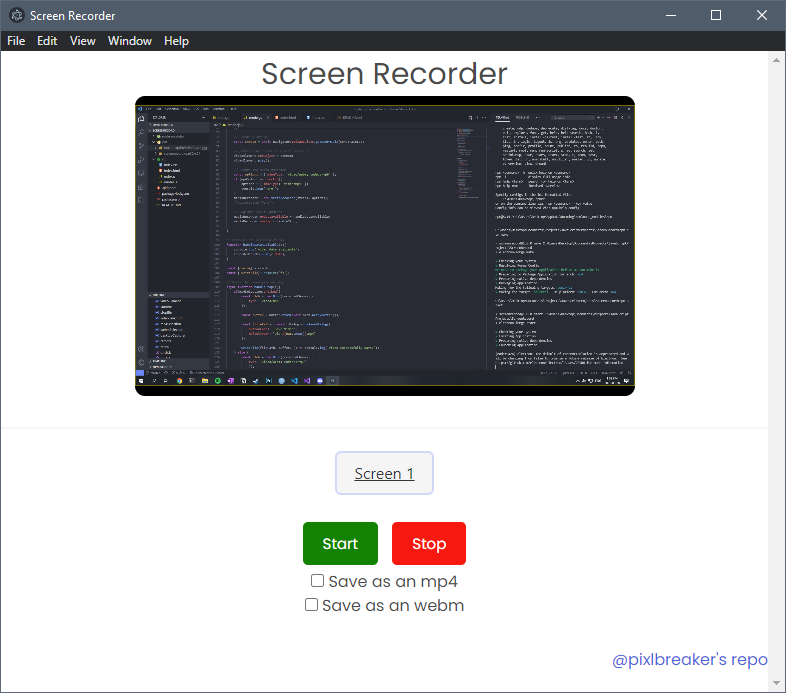

# Screen Recorder
This project utilizes very basic electron application techniques to get a Screen Recorder working in Electron with node.js

## Features
This screen recorder can select any possible screen or application detected by the system and use it to record.

Grants the ability to save the file in 2 different file types:
- mp4
- webm

## Screenshots

An example of a the application

### Source
Follows [this](https://youtu.be/3yqDxhR2XxE?list=PLJeE3c06PNfwS1i3xpK_8QWd5QZ4BqMCt) youtube link that goes step by step onto how this works.